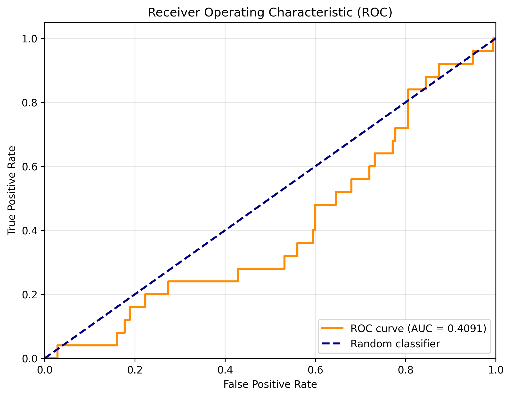
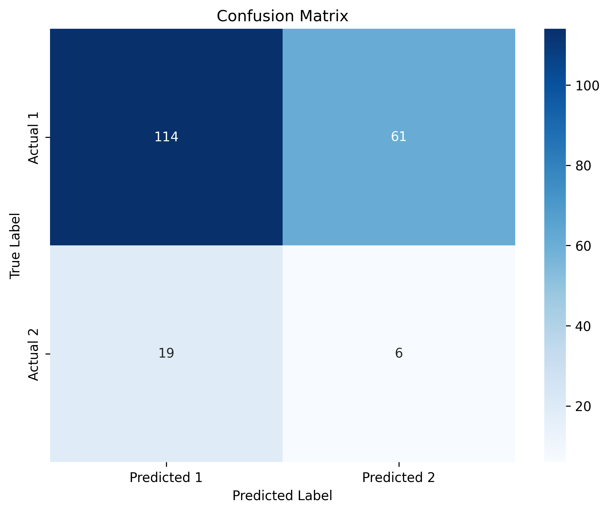

# 实验报告 - LR Model

**生成时间**: 2026-04-11 18:33:01

---

## 1. 实验概述

### 1.1 模型配置

| 参数 | 值 |
|------|-----|
| model_name | logistic_regression |
| C | 1.0 |
| penalty | l2 |
| max_iter | 1000 |
| class_weight | balanced |
| feature_selection | True |
| k_best | 50 |

### 1.2 数据信息

| 属性 | 值 |
|------|-----|
| 总样本数 | 1000 |
| 训练集大小 | 700 (70.0%) |
| 验证集大小 | 100 (10.0%) |
| 测试集大小 | 200 (20.0%) |
| 特征维度 | 207 |

### 1.3 标签分布

| 标签 | 数量 | 比例 |
|------|------|------|
| 1 | 876 | 87.60% |
| 2 | 124 | 12.40% |

---

## 2. 实验结果

### 2.1 训练集表现

| 指标 | 值 |
|------|-----|
| AUC | 0.649697 |
| LOGLOSS | 0.652564 |
| ACCURACY | 0.672857 |

### 2.2 验证集表现

| 指标 | 值 |
|------|-----|
| AUC | 0.433712 |
| LOGLOSS | 0.715379 |
| ACCURACY | 0.620000 |

### 2.3 测试集表现

| 指标 | 值 |
|------|-----|
| AUC | 0.409143 |
| LOGLOSS | 0.696433 |
| ACCURACY | 0.600000 |

---

## 3. 可视化结果

### 3.1 ROC 曲线

### 3.2 混淆矩阵

---

## 4. 特征重要性

### Top 20 重要特征

| 排名 | 特征名 | 重要性 |
|------|--------|--------|
| 1 | domain_c_seq_36_max | 0.000003 |
| 2 | domain_b_seq_74_max | 0.000001 |
| 3 | domain_c_seq_34_mean | 0.000001 |
| 4 | item_int_feats_16 | 0.000001 |
| 5 | user_dense_feats_62_mean | 0.000001 |
| 6 | domain_b_seq_72_mean | 0.000000 |
| 7 | domain_b_seq_72_max | 0.000000 |
| 8 | domain_b_seq_73_mean | 0.000000 |
| 9 | item_int_feats_7 | 0.000000 |
| 10 | domain_c_seq_29_max | 0.000000 |
| 11 | domain_b_seq_71_mean | 0.000000 |
| 12 | user_int_feats_66_mean | 0.000000 |
| 13 | domain_c_seq_31_mean | 0.000000 |
| 14 | domain_c_seq_35_mean | 0.000000 |
| 15 | domain_a_seq_42_mean | 0.000000 |
| 16 | item_int_feats_6 | 0.000000 |
| 17 | domain_a_seq_39_mean | 0.000000 |
| 18 | domain_c_seq_47_mean | 0.000000 |
| 19 | domain_a_seq_39_max | 0.000000 |
| 20 | domain_d_seq_18_mean | 0.000000 |

---

## 5. 文件说明

| 文件名 | 说明 |
|--------|------|
| `results.json` | 实验结果（JSON格式） |
| `roc_curve.png` | ROC曲线可视化 |
| `confusion_matrix.png` | 混淆矩阵可视化 |
| `feature_importance.csv` | 特征重要性详细数据 |
| `model/` | 保存的模型文件 |
| `experiment_report.md` | 本实验报告 |

---

## 6. 结论与建议

### 6.1 主要发现
- 测试集 AUC: 0.4091
- 测试集 LogLoss: 0.6964
- 测试集 Accuracy: 0.6000

### 6.2 改进方向
1. **特征工程**: 尝试更多的特征组合和交叉特征
2. **模型调优**: 使用网格搜索或贝叶斯优化调整超参数
3. **集成学习**: 尝试模型融合策略
4. **深度学习**: 实现 DeepFM、DIN 等深度学习模型
5. **序列建模**: 充分利用 45 列 Domain Sequence 特征

---

*本报告由自动化脚本生成*
