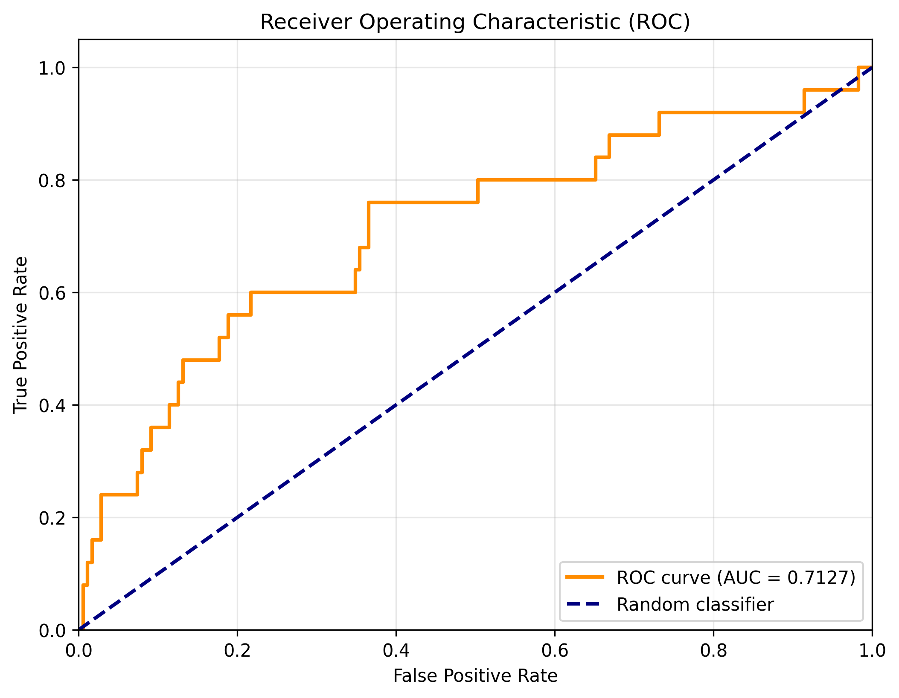
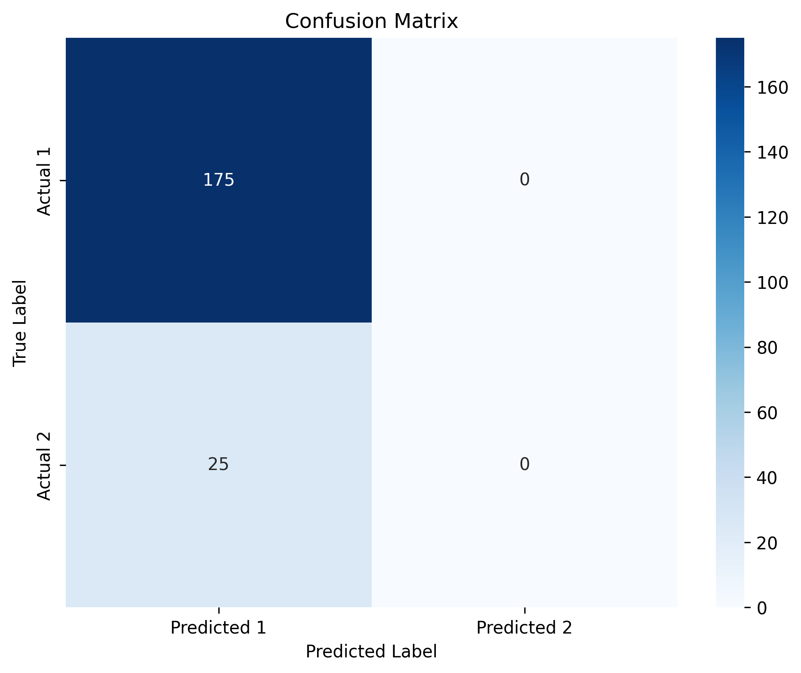

# 实验报告 - XGB Model

**生成时间**: 2026-04-11 18:37:58

---

## 1. 实验概述

### 1.1 模型配置

| 参数 | 值 |
|------|-----|
| model_name | xgboost |
| n_estimators | 100 |
| max_depth | 6 |
| learning_rate | 0.1 |
| subsample | 0.8 |
| colsample_bytree | 0.8 |
| early_stopping_rounds | 10 |

### 1.2 数据信息

| 属性 | 值 |
|------|-----|
| 总样本数 | 1000 |
| 训练集大小 | 700 (70.0%) |
| 验证集大小 | 100 (10.0%) |
| 测试集大小 | 200 (20.0%) |
| 特征维度 | 207 |

### 1.3 标签分布

| 标签 | 数量 | 比例 |
|------|------|------|
| 1 | 876 | 87.60% |
| 2 | 124 | 12.40% |

---

## 2. 实验结果

### 2.1 训练集表现

| 指标 | 值 |
|------|-----|
| AUC | 1.000000 |
| LOGLOSS | 0.023516 |
| ACCURACY | 1.000000 |

### 2.2 验证集表现

| 指标 | 值 |
|------|-----|
| AUC | 0.553030 |
| LOGLOSS | 0.490057 |
| ACCURACY | 0.880000 |

### 2.3 测试集表现

| 指标 | 值 |
|------|-----|
| AUC | 0.712686 |
| LOGLOSS | 0.414948 |
| ACCURACY | 0.875000 |

---

## 3. 可视化结果

### 3.1 ROC 曲线

### 3.2 混淆矩阵

---

## 4. 特征重要性

### Top 20 重要特征

| 排名 | 特征名 | 重要性 |
|------|--------|--------|
| 1 | domain_c_seq_28_max | 0.027254 |
| 2 | user_dense_feats_66_mean | 0.022529 |
| 3 | item_int_feats_13 | 0.016605 |
| 4 | user_int_feats_64_mean | 0.016460 |
| 5 | domain_a_seq_43_max | 0.016360 |
| 6 | user_int_feats_86 | 0.016105 |
| 7 | domain_c_seq_27_max | 0.015703 |
| 8 | item_int_feats_5 | 0.015064 |
| 9 | domain_d_seq_20_max | 0.015032 |
| 10 | user_int_feats_107 | 0.015030 |
| 11 | domain_b_seq_75_max | 0.011608 |
| 12 | domain_c_seq_29_max | 0.011528 |
| 13 | user_int_feats_62_mean | 0.011147 |
| 14 | domain_c_seq_47_mean | 0.011119 |
| 15 | user_dense_feats_64_mean | 0.011098 |
| 16 | domain_b_seq_71_mean | 0.010858 |
| 17 | domain_c_seq_31_max | 0.010659 |
| 18 | domain_c_seq_29_len | 0.010216 |
| 19 | domain_a_seq_41_mean | 0.010114 |
| 20 | user_int_feats_80_mean | 0.010006 |

---

## 5. 文件说明

| 文件名 | 说明 |
|--------|------|
| `results.json` | 实验结果（JSON格式） |
| `roc_curve.png` | ROC曲线可视化 |
| `confusion_matrix.png` | 混淆矩阵可视化 |
| `feature_importance.csv` | 特征重要性详细数据 |
| `model/` | 保存的模型文件 |
| `experiment_report.md` | 本实验报告 |

---

## 6. 结论与建议

### 6.1 主要发现
- 测试集 AUC: 0.7127
- 测试集 LogLoss: 0.4149
- 测试集 Accuracy: 0.8750

### 6.2 改进方向
1. **特征工程**: 尝试更多的特征组合和交叉特征
2. **模型调优**: 使用网格搜索或贝叶斯优化调整超参数
3. **集成学习**: 尝试模型融合策略
4. **深度学习**: 实现 DeepFM、DIN 等深度学习模型
5. **序列建模**: 充分利用 45 列 Domain Sequence 特征

---

*本报告由自动化脚本生成*
